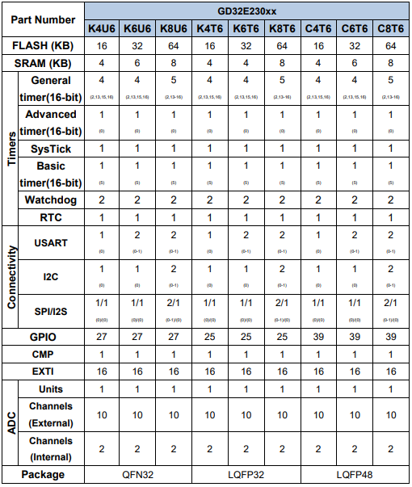

# [GD32E230](https://github.com/SoCXin/GD32E230)

* [GigaDevice](https://www.gigadevice.com/zh-hans)：[Cortex-M23](https://github.com/SoCXin/Cortex)
* [L3R3](https://github.com/SoCXin/Level)：72 MHz (55DMIPS/154CoreMark)

## [简介](https://github.com/SoCXin/GD32E230/wiki)

[GD32E230](https://github.com/SoCXin/GD32E230) 采用了业界领先的55nm低功耗工艺制程，配备了16KB到64KB的嵌入式闪存及4KB到8KB的SRAM，配合内置的硬件乘法器、除法器和加速单元，在最高主频下的工作性能可达55DMIPS，CoreMark®测试可达154分。同主频下的代码执行效率相比市场同类Cortex®-M0产品提高40%，相比Cortex®-M0+产品也提高30%以上。

### 关键特性

* 2 x USART Irda/LIN/ISO7816

#### 封装规格

* LGA20 (3 x 3 x 0.4mm)
* TSSOP20 (4.4 x 6.5 x 1mm)
* QFN28 (4 x 4 x 0.85mm)
* QFN32 (5 x 5 x 0.85mm)
* LQFP32 (7 x 7 x 1.4mm)
* LQFP48 (7 x 7 x 1.4mm)

### [选型建议](https://github.com/SoCXin)

[GD32E230](https://github.com/SoCXin/GD32E230)

### [探索芯世界 www.SoC.xin](http://www.SoC.Xin)
